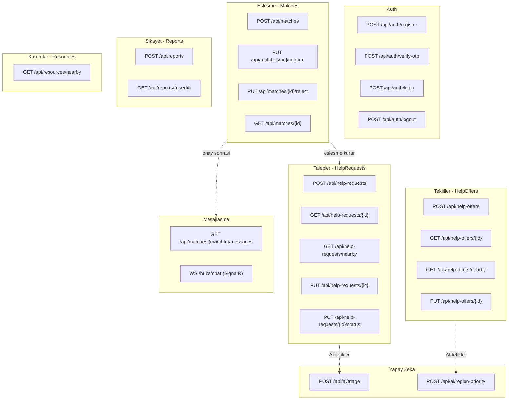

```mermaid
flowchart TD
    subgraph Auth["Auth"]
        A1["POST /api/auth/register"]
        A2["POST /api/auth/verify-otp"]
        A3["POST /api/auth/login"]
        A4["POST /api/auth/logout"]
    end

    subgraph Requests["Talepler - HelpRequests"]
        R1["POST /api/help-requests"]
        R2["GET /api/help-requests/{id}"]
        R3["GET /api/help-requests/nearby"]
        R4["PUT /api/help-requests/{id}"]
        R5["PUT /api/help-requests/{id}/status"]
    end

    subgraph Offers["Teklifler - HelpOffers"]
        O1["POST /api/help-offers"]
        O2["GET /api/help-offers/{id}"]
        O3["GET /api/help-offers/nearby"]
        O4["PUT /api/help-offers/{id}"]
    end

    subgraph Matches["Eslesme - Matches"]
        M1["POST /api/matches"]
        M2["PUT /api/matches/{id}/confirm"]
        M3["PUT /api/matches/{id}/reject"]
        M4["GET /api/matches/{id}"]
    end

    subgraph Messages["Mesajlasma"]
        MS1["GET /api/matches/{matchId}/messages"]
        MS2["WS /hubs/chat (SignalR)"]
    end

    subgraph Reports["Sikayet - Reports"]
        RP1["POST /api/reports"]
        RP2["GET /api/reports/{userId}"]
    end

    subgraph Resources["Kurumlar - Resources"]
        RS1["GET /api/resources/nearby"]
    end

    subgraph AI["Yapay Zeka"]
        AI1["POST /api/ai/triage"]
        AI2["POST /api/ai/region-priority"]
    end

    Requests -.->|"AI tetikler"| AI1
    Matches -.->|"onay sonrasi"| Messages
    Matches -.->|"eslesme kurar"| Requests
    Offers -.->|"AI tetikler"| AI2
```
