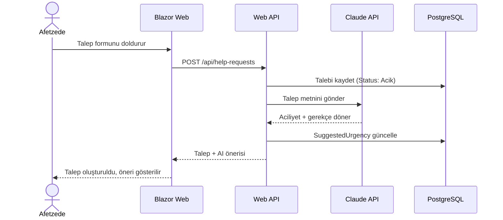

```mermaid
sequenceDiagram
    actor A as Afetzede
    participant W as Blazor Web
    participant API as Web API
    participant AI as Claude API
    participant DB as PostgreSQL

    A->>W: Talep formunu doldurur
    W->>API: POST /api/help-requests
    API->>DB: Talebi kaydet (Status: Acik)
    API->>AI: Talep metnini gönder
    AI-->>API: Aciliyet + gerekçe döner
    API->>DB: SuggestedUrgency güncelle
    API-->>W: Talep + AI önerisi
    W-->>A: Talep oluşturuldu, öneri gösterilir
```
