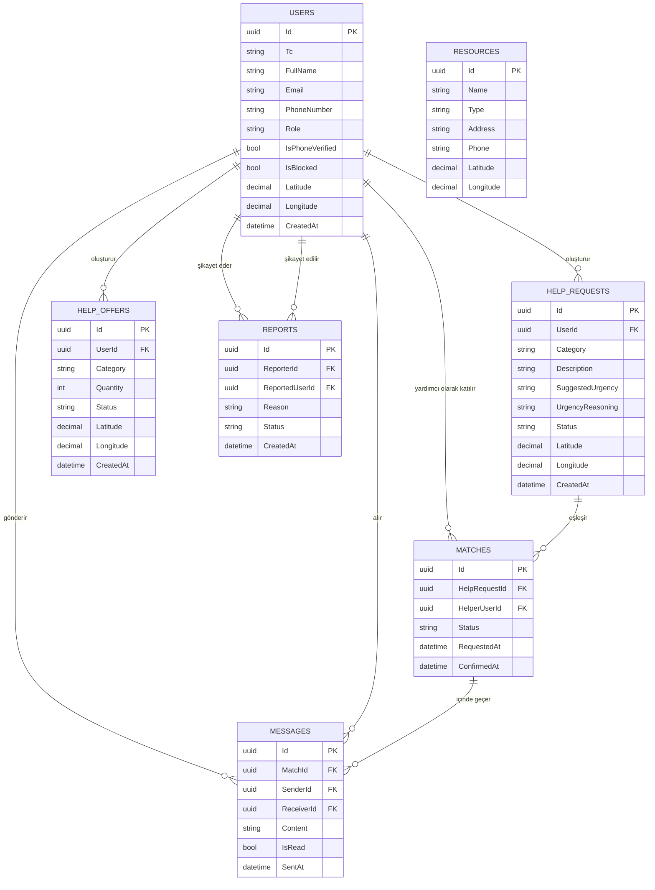

```mermaid
erDiagram
    USERS ||--o{ HELP_REQUESTS : "oluşturur"
    USERS ||--o{ HELP_OFFERS : "oluşturur"
    USERS ||--o{ MATCHES : "yardımcı olarak katılır"
    USERS ||--o{ MESSAGES : "gönderir"
    USERS ||--o{ MESSAGES : "alır"
    USERS ||--o{ REPORTS : "şikayet eder"
    USERS ||--o{ REPORTS : "şikayet edilir"
    HELP_REQUESTS ||--o{ MATCHES : "eşleşir"
    MATCHES ||--o{ MESSAGES : "içinde geçer"

    USERS {
        uuid Id PK
        string Tc
        string FullName
        string Email
        string PhoneNumber
        string Role
        bool IsPhoneVerified
        bool IsBlocked
        decimal Latitude
        decimal Longitude
        datetime CreatedAt
    }

    HELP_REQUESTS {
        uuid Id PK
        uuid UserId FK
        string Category
        string Description
        string SuggestedUrgency
        string UrgencyReasoning
        string Status
        decimal Latitude
        decimal Longitude
        datetime CreatedAt
    }

    HELP_OFFERS {
        uuid Id PK
        uuid UserId FK
        string Category
        int Quantity
        string Status
        decimal Latitude
        decimal Longitude
        datetime CreatedAt
    }

    MATCHES {
        uuid Id PK
        uuid HelpRequestId FK
        uuid HelperUserId FK
        string Status
        datetime RequestedAt
        datetime ConfirmedAt
    }

    MESSAGES {
        uuid Id PK
        uuid MatchId FK
        uuid SenderId FK
        uuid ReceiverId FK
        string Content
        bool IsRead
        datetime SentAt
    }

    REPORTS {
        uuid Id PK
        uuid ReporterId FK
        uuid ReportedUserId FK
        string Reason
        string Status
        datetime CreatedAt
    }

    RESOURCES {
        uuid Id PK
        string Name
        string Type
        string Address
        string Phone
        decimal Latitude
        decimal Longitude
    }
```
