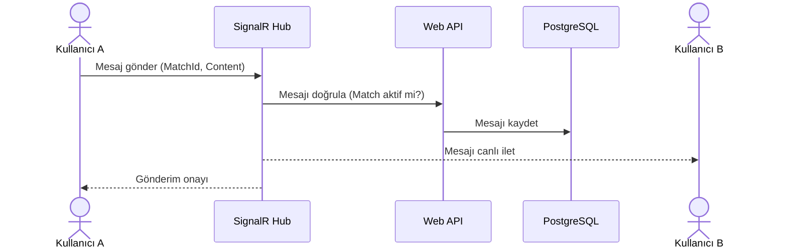

```mermaid
sequenceDiagram
actor U1 as Kullanıcı A
participant Hub as SignalR Hub
participant API as Web API
participant DB as PostgreSQL
actor U2 as Kullanıcı B

    U1->>Hub: Mesaj gönder (MatchId, Content)
    Hub->>API: Mesajı doğrula (Match aktif mi?)
    API->>DB: Mesajı kaydet
    Hub-->>U2: Mesajı canlı ilet
    Hub-->>U1: Gönderim onayı
```
