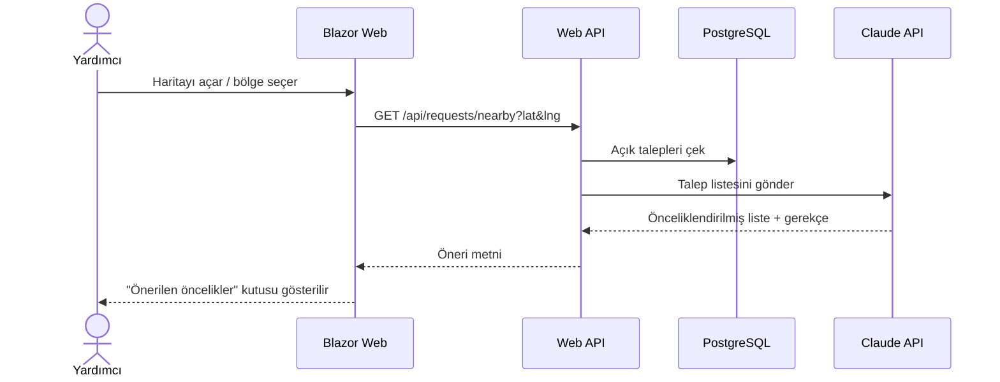

```mermaid
sequenceDiagram
    actor Y as Yardımcı
    participant W as Blazor Web
    participant API as Web API
    participant DB as PostgreSQL
    participant AI as Claude API

    Y->>W: Haritayı açar / bölge seçer
    W->>API: GET /api/requests/nearby?lat&lng
    API->>DB: Açık talepleri çek
    API->>AI: Talep listesini gönder
    AI-->>API: Önceliklendirilmiş liste + gerekçe
    API-->>W: Öneri metni
    W-->>Y: "Önerilen öncelikler" kutusu gösterilir
```
