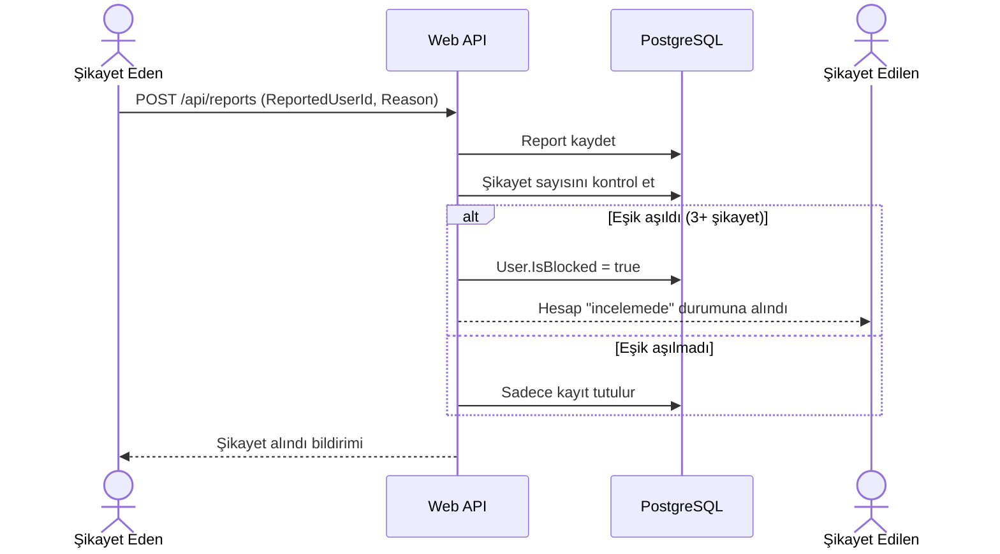

```mermaid
sequenceDiagram
    actor U1 as Şikayet Eden
    participant API as Web API
    participant DB as PostgreSQL
    actor U2 as Şikayet Edilen

    U1->>API: POST /api/reports (ReportedUserId, Reason)
    API->>DB: Report kaydet
    API->>DB: Şikayet sayısını kontrol et
    alt Eşik aşıldı (3+ şikayet)
        API->>DB: User.IsBlocked = true
        API-->>U2: Hesap "incelemede" durumuna alındı
    else Eşik aşılmadı
        API->>DB: Sadece kayıt tutulur
    end
    API-->>U1: Şikayet alındı bildirimi
```
