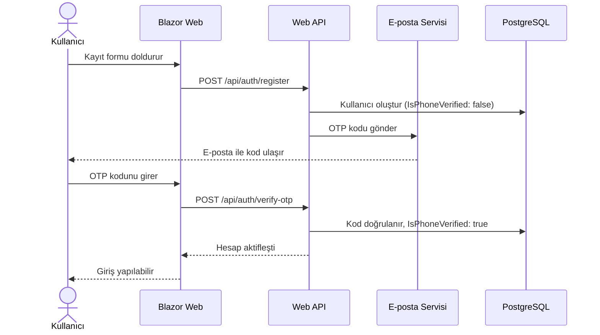

```mermaid
sequenceDiagram
    actor U as Kullanıcı
    participant W as Blazor Web
    participant API as Web API
    participant Mail as E-posta Servisi
    participant DB as PostgreSQL

    U->>W: Kayıt formu doldurur
    W->>API: POST /api/auth/register
    API->>DB: Kullanıcı oluştur (IsPhoneVerified: false)
    API->>Mail: OTP kodu gönder
    Mail-->>U: E-posta ile kod ulaşır
    U->>W: OTP kodunu girer
    W->>API: POST /api/auth/verify-otp
    API->>DB: Kod doğrulanır, IsPhoneVerified: true
    API-->>W: Hesap aktifleşti
    W-->>U: Giriş yapılabilir
```
