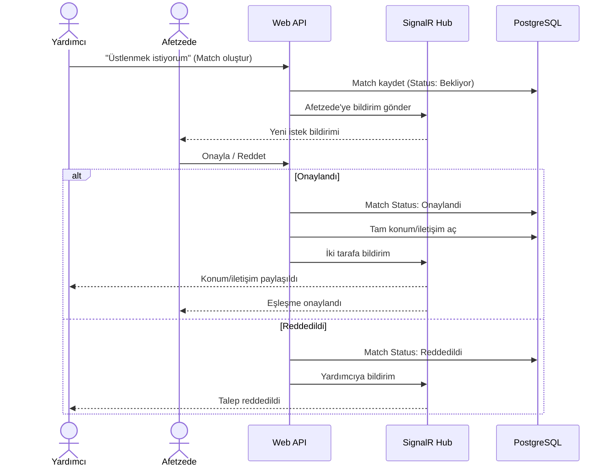

```mermaid
sequenceDiagram
    actor Y as Yardımcı
    actor A as Afetzede
    participant API as Web API
    participant Hub as SignalR Hub
    participant DB as PostgreSQL

    Y->>API: "Üstlenmek istiyorum" (Match oluştur)
    API->>DB: Match kaydet (Status: Bekliyor)
    API->>Hub: Afetzede'ye bildirim gönder
    Hub-->>A: Yeni istek bildirimi
    A->>API: Onayla / Reddet
    alt Onaylandı
        API->>DB: Match Status: Onaylandi
        API->>DB: Tam konum/iletişim aç
        API->>Hub: İki tarafa bildirim
        Hub-->>Y: Konum/iletişim paylaşıldı
        Hub-->>A: Eşleşme onaylandı
    else Reddedildi
        API->>DB: Match Status: Reddedildi
        API->>Hub: Yardımcıya bildirim
        Hub-->>Y: Talep reddedildi
    end
```
