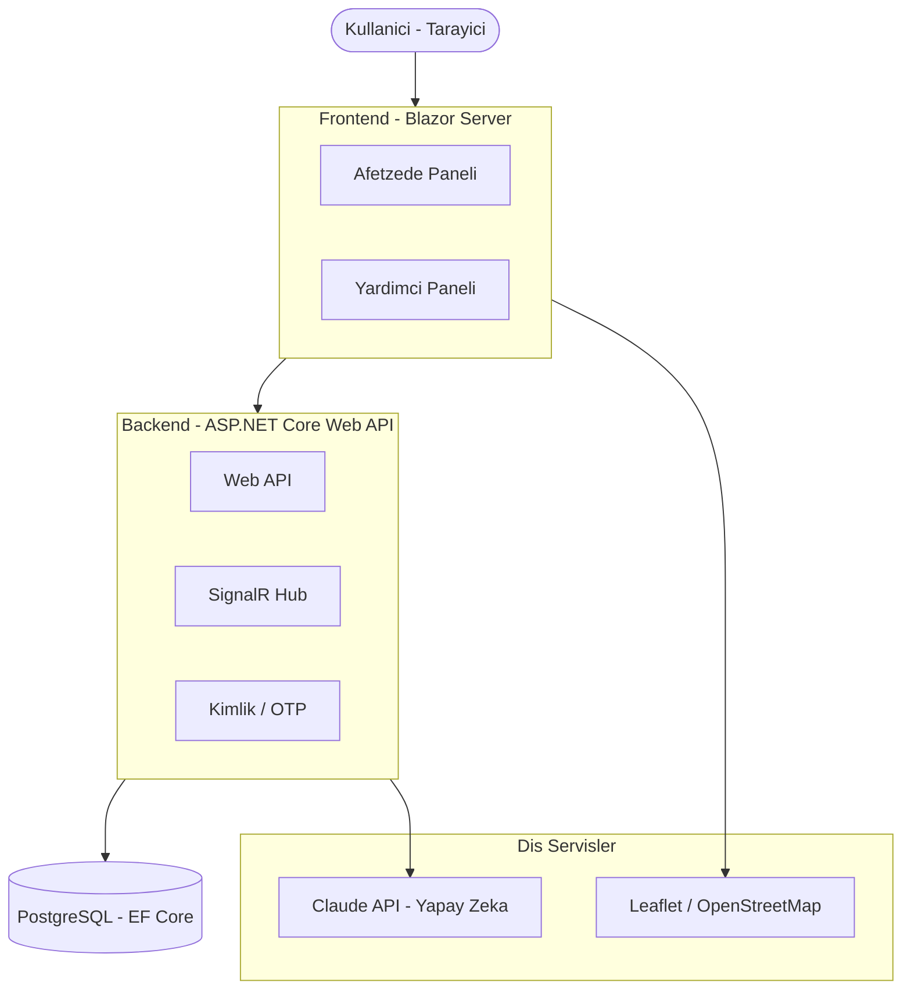

```mermaid

flowchart TD
    User(["Kullanici - Tarayici"])

    subgraph Frontend["Frontend - Blazor Server"]
        Afetzede["Afetzede Paneli"]
        Yardimci["Yardimci Paneli"]
    end

    subgraph Backend["Backend - ASP.NET Core Web API"]
        WebAPI["Web API"]
        SignalR["SignalR Hub"]
        Identity["Kimlik / OTP"]
    end

    DB[("PostgreSQL - EF Core")]

    subgraph External["Dis Servisler"]
        Claude["Claude API - Yapay Zeka"]
        Leaflet["Leaflet / OpenStreetMap"]
    end

    User --> Frontend
    Frontend --> Backend
    Backend --> DB
    Backend --> Claude
    Frontend --> Leaflet
```
