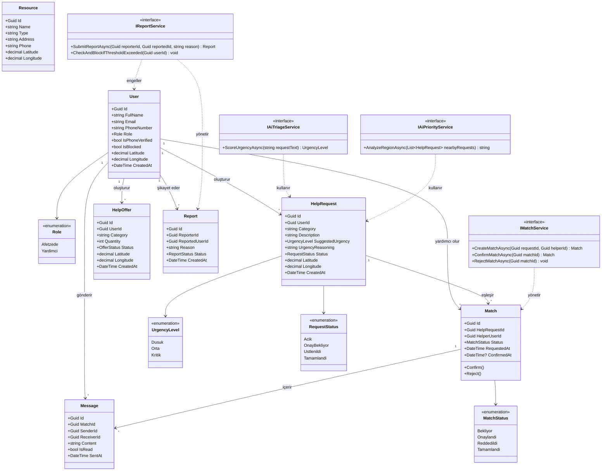

```mermaid
classDiagram
    class User {
        +Guid Id
        +string FullName
        +string Email
        +string PhoneNumber
        +Role Role
        +bool IsPhoneVerified
        +bool IsBlocked
        +decimal Latitude
        +decimal Longitude
        +DateTime CreatedAt
    }

    class Role {
        <<enumeration>>
        Afetzede
        Yardimci
    }

    class HelpRequest {
        +Guid Id
        +Guid UserId
        +string Category
        +string Description
        +UrgencyLevel SuggestedUrgency
        +string UrgencyReasoning
        +RequestStatus Status
        +decimal Latitude
        +decimal Longitude
        +DateTime CreatedAt
    }

    class HelpOffer {
        +Guid Id
        +Guid UserId
        +string Category
        +int Quantity
        +OfferStatus Status
        +decimal Latitude
        +decimal Longitude
        +DateTime CreatedAt
    }

    class Match {
        +Guid Id
        +Guid HelpRequestId
        +Guid HelperUserId
        +MatchStatus Status
        +DateTime RequestedAt
        +DateTime? ConfirmedAt
        +Confirm()
        +Reject()
    }

    class Message {
        +Guid Id
        +Guid MatchId
        +Guid SenderId
        +Guid ReceiverId
        +string Content
        +bool IsRead
        +DateTime SentAt
    }

    class Report {
        +Guid Id
        +Guid ReporterId
        +Guid ReportedUserId
        +string Reason
        +ReportStatus Status
        +DateTime CreatedAt
    }

    class Resource {
        +Guid Id
        +string Name
        +string Type
        +string Address
        +string Phone
        +decimal Latitude
        +decimal Longitude
    }

    class UrgencyLevel {
        <<enumeration>>
        Dusuk
        Orta
        Kritik
    }

    class RequestStatus {
        <<enumeration>>
        Acik
        OnayBekliyor
        Ustlenildi
        Tamamlandi
    }

    class MatchStatus {
        <<enumeration>>
        Bekliyor
        Onaylandi
        Reddedildi
        Tamamlandi
    }

    class IAiTriageService {
        <<interface>>
        +ScoreUrgencyAsync(string requestText) UrgencyLevel
    }

    class IAiPriorityService {
        <<interface>>
        +AnalyzeRegionAsync(List~HelpRequest~ nearbyRequests) string
    }

    class IMatchService {
        <<interface>>
        +CreateMatchAsync(Guid requestId, Guid helperId) Match
        +ConfirmMatchAsync(Guid matchId) Match
        +RejectMatchAsync(Guid matchId) void
    }

    class IReportService {
        <<interface>>
        +SubmitReportAsync(Guid reporterId, Guid reportedId, string reason) Report
        +CheckAndBlockIfThresholdExceeded(Guid userId) void
    }

    User "1" --> "*" HelpRequest : oluşturur
    User "1" --> "*" HelpOffer : oluşturur
    User "1" --> "*" Match : yardımcı olur
    User "1" --> "*" Message : gönderir
    User "1" --> "*" Report : şikayet eder
    User --> Role

    HelpRequest "1" --> "*" Match : eşleşir
    HelpRequest --> UrgencyLevel
    HelpRequest --> RequestStatus

    Match "1" --> "*" Message : içerir
    Match --> MatchStatus

    IAiTriageService ..> HelpRequest : kullanır
    IAiPriorityService ..> HelpRequest : kullanır
    IMatchService ..> Match : yönetir
    IReportService ..> Report : yönetir
    IReportService ..> User : engeller
```
